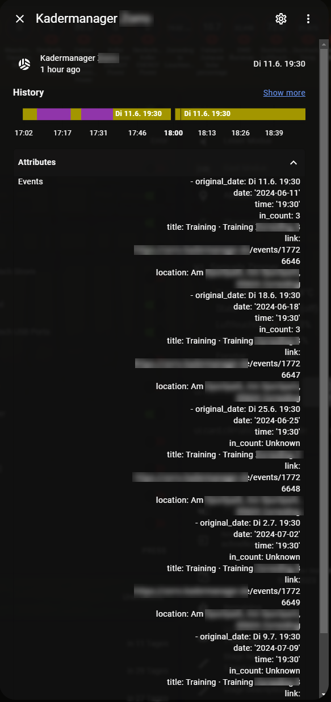

# Kadermanager Homeassistant Integration
The `kadermanager` sensor will give informations about events and participants




## Installation
### 1. Using HACS (recommended way)

Not available in HACS yet, but it is planned.

### 2. Manual

- Download the latest zip release from [here](https://github.com/FaserF/ha-kadermanager/releases/latest)
- Extract the zip file
- Copy the folder "kadermanager" from within custom_components with all of its components to `<config>/custom_components/`

where `<config>` is your Home Assistant configuration directory.

>__NOTE__: Do not download the file by using the link above directly, the status in the "master" branch can be in development and therefore is maybe not working.

## Configuration

Go to Configuration -> Integrations and click on "add integration". Then search for "Kadermanager".

[](https://my.home-assistant.io/redirect/config_flow_start/?domain=kadermanager)

### Configuration Variables
- **team name**: input your kadermanager teamname (it usually is your kadermanager subdomain, f.e.: teamname.kadermanager.de)
- **refresh time**: the refresh interval in minutes
- **event limit**: the event limit count that should be fetched
- **fetch player info**: try player info fetching (like event response) or not -> If the events are not public, you can disable this to lower the traffic
- **fetch comments**: try event comments fetching -> If the events are not public, you can disable this to lower the traffic

**IMPORTANT: Currently it looks like sign in by "bots" are blocked from kadermanager, therefore login wont work (yet)**
- **username** (optional - without less informations can be fetched): input your kadermanager username (usually an email)
- **password** (optional - without less informations can be fetched): input your kadermanager password

## Sensor Attributes
The data is being refreshed every 30 minutes per default, unless otherwise defined in the refresh time.

### General attributes
- events: 
  - original_date: Displays the Date and Time for the event
  - comments: Displays event specific comments
    - text
    - author
  - date: extracted date from original_date
  - time: extraced time from original_date
  - in_count: Current count of people in for the event
  - title: Event title (will be filled with the type if empty)
  - type: Event type (training/game/other)
  - link: Link to the event
  - location: Location of the event

### Attributes available with sign in / public events
Those data will only be fetched for the next upcoming event.

Currently signing in wont work, as bots seem to be blocked. But you can check your events to be public readable, then the following data can also be fetched: 

- events: 
  - players: 
    - accepted_players (will only be fetched if "fetch player info" is turned on): Players that accepted the event
    - declined_players (will only be fetched if "fetch player info" is turned on): Players that declined the event
    - no_response_players (will only be fetched if "fetch player info" is turned on): Players that gave no response if they are attending or not

- events: 
  - comments: 
    - author: player that has written the comment
    - text: Text written in the comment

### Attributes available with sign in (doesnt matter if events are public)
Currently signing in wont work, as bots seem to be blocked.
- comments: Displays all general comments from the main page, which are not event related

## Automation example
Send a reminder for the next event two days before

```yaml
automation:
  - alias: "Reminder for Kadermanager event two days before"
    trigger:
      - platform: template
        value_template: "{{ as_timestamp(states.sensor.kadermanager_teamname.attributes.events[0].date) - as_timestamp(now()) <= 2 * 24 * 3600 }}"
    condition:
      - condition: template
        value_template: "{{ states.sensor.kadermanager_teamname.attributes.events }}"
    action:
      - service: notify.notify
        data_template:
          title: "Upcoming kadermanager event"
          message: >
            The next Kadermanager event is coming:
            Type: {{ states.sensor.kadermanager_teamname.attributes.events[0].type }}
            Titel: {{ states.sensor.kadermanager_teamname.attributes.events[0].title }}
            Accepted Count: {{ states.sensor.kadermanager_teamname.attributes.events[0].in_count }}
            Who has declined: {{ states.sensor.kadermanager_teamname.attributes.events[0].players.declined_players | join(', ') }}
```

Send a message if a new kadermanager event has been written
```yaml
automation:
  - alias: "Notification on New Comment"
    trigger:
      - platform: state
        entity_id: sensor.kadermanager_teamname
    condition:
      # Check if the comment has changed
      condition: template
      value_template: >
        
        
        {{ new_comments | length > old_comments | length }}
    action:
      - service: notify.notify
        data:
          message: >
            New comment by {{ states.sensor.kadermanager_teamname.attributes.events[0].comments[0].author }}: 
            {{ states.sensor.kadermanager_teamname.attributes.events[0].comments[0].text }}
```

## Bug reporting
Open an issue over at [github issues](https://github.com/FaserF/ha-kadermanager/issues). Please prefer sending over a log with debugging enabled.

To enable debugging enter the following in your configuration.yaml

```yaml
logger:
    logs:
        custom_components.kadermanager: debug
```

You can then find the log in the HA settings -> System -> Logs -> Enter "kadermanager" in the search bar -> "Load full logs"

## Thanks to
Thanks to Kadermanager for their great free software!

The data is coming from the [kadermanager.de](https://kadermanager.de/) website.
