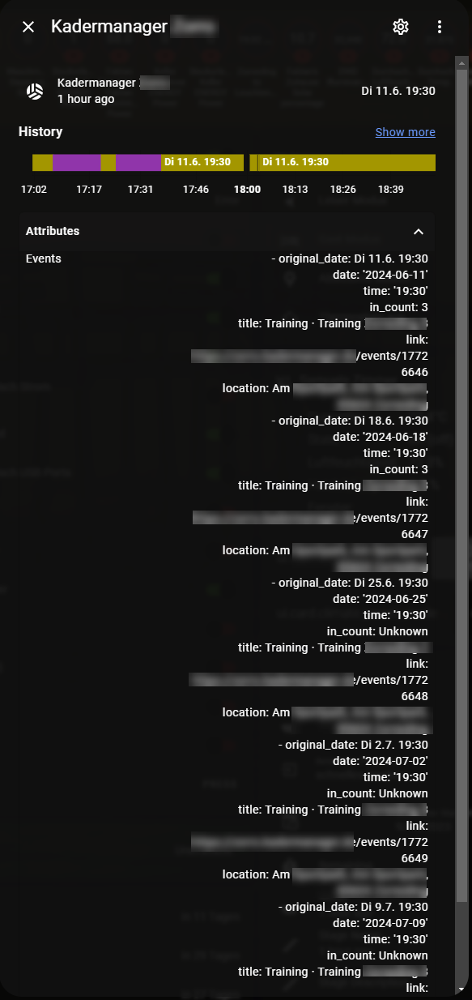

[](https://github.com/hacs/integration)

# Kadermanager Home Assistant Integration ⚽

The `kadermanager` integration retrieves event and participant information from [Kadermanager](https://kadermanager.de/).




## Features ✨

- **Smart Dynamic Interval**: Intelligently scales update frequency based on event proximity (e.g. 30min during games, 12h when idle) to maximize data freshness while protecting your IP.
- **Force Update**: Manual override to bypass all back-offs and jitter for an immediate refresh.
- **Event Tracking**: See upcoming games/trainings, dates, and locations.
- **Participation Stats**: Monitor how many people accepted or declined.
- **Comments**: View latest comments on events.
- **Modern Communication**: Uses asynchronous `aiohttp` and browsers-like headers to blend in and avoid blocking.
- **Persistent Sessions**: Maintains login state across updates to minimize redundant authentication.
- **Persistence & Survival**: Caches data locally to survive Home Assistant restarts and temporary IP bans.
- **Bot Protection**: Implements automated back-off, randomized jitter, and rotated User-Agents to mimic human behavior.
- **Self-Repair**: Automatically detects persistent failures (>24h) and creates a generic Repair issue in Home Assistant.

> [!TIP]
> **Smart Dynamic Interval Logic**:
> - **Active Phase**: During and up to 3h after event start -> **30 min** updates (catches live updates & comments).
> - **Recap Phase**: 3h to 6h after event start -> **2h** updates.
> - **Proximity Phase**: Within 24h before event -> **60 min** updates.
> - **Idle Phase**: Otherwise -> **12h** updates.

> [!WARNING]
> **Softbans & Scraping Policy**: Since this integration uses web scraping, it is subject to the website's anti-bot measures. To ensure long-term stability and avoid permanent IP bans, the minimum update interval is generally enforced at **60 minutes** unless using the Smart Interval feature or manual Force Update.

## Installation 🛠️

### 1. Using HACS (Recommended)

This integration works as a **Custom Repository** in HACS.

1.  Open HACS.
2.  Add Custom Repository: `https://github.com/FaserF/ha-kadermanager` (Category: Integration).
3.  Click **Download**.
4.  Restart Home Assistant.

[](https://my.home-assistant.io/redirect/hacs_repository/?owner=FaserF&repository=ha-kadermanager&category=integration)

### 2. Manual Installation

1.  Download the latest [Release](https://github.com/FaserF/ha-kadermanager/releases/latest).
2.  Extract the ZIP file.
3.  Copy the `kadermanager` folder to `<config>/custom_components/`.
4.  Restart Home Assistant.

## Configuration ⚙️

1.  Go to **Settings** -> **Devices & Services**.
2.  Click **Add Integration**.
3.  Search for "Kadermanager".

[](https://my.home-assistant.io/redirect/config_flow_start/?domain=kadermanager)

### Configuration Variables
- **Team Name**: Your subdomain (e.g., `teamname` for `teamname.kadermanager.de`).
- **Username/Password**: (Optional) Providing credentials allows the integration to log in and fetch non-public events/details.
- **Additional Settings**: Smart update interval, manual force update, event limits, comment fetching.

## Sensor Attributes
The data is being refreshed every 60 minutes by default.

### General attributes
- events:
  - original_date: Displays the Date and Time for the event
  - comments: Displays event specific comments (author, text)
  - date: extracted date (ISO format)
  - time: extracted time
  - in_count: Current count of people in for the event
  - title: Event title
  - type: Event type (Training/Spiel/Sonstiges)
  - link: Link to the event
  - location: Location of the event

### Attributes available with public events
If your events are public, the following data can also be fetched:

- events:
  - players:
    - accepted_players: Players that accepted
    - declined_players: Players that declined
    - no_response_players: Players that gave no response

## Troubleshooting ⚠️

### Status "Unknown"
If the sensor status shows "Unknown":
1.  **Check Team Name**: Ensure your team name corresponds exactly to the subdomain (e.g., `https://myteam.kadermanager.de` -> `myteam`).
2.  **Access/Login**: Ensure your "Events" page allows public viewing OR that you have provided valid username/password in the configuration. The integration attempts to log in if credentials are provided.
3.  **Logs**: Enable debug logging to see what the scraper is receiving.

```yaml
logger:
    logs:
        custom_components.kadermanager: debug
```

## Automation Examples 🤖

<details>
<summary><b>📅 Reminder: Upcoming Event (2 days before)</b></summary>

Send a notification 48 hours before the next event starts.

```yaml
automation:
  - alias: "Kadermanager Reminder - 2 Days Warning"
    trigger:
      - platform: template
        value_template: >
          
          
            {{ as_timestamp(events[0].date) - as_timestamp(now()) <= 2 * 24 * 3600 }}
          
            false
          
    action:
      - service: notify.notify
        data:
          title: "Upcoming Event"
          message: >
            
            Next Event: {{ event.title }}
            Date: {{ event.original_date }}
            Participants: {{ event.in_count }}
```
</details>

<details>
<summary><b>⚠️ Alert: Low Participation Count</b></summary>

Warn if less than 6 players are signed up 24 hours before a game.

```yaml
automation:
  - alias: "Kadermanager - Low Participation Warning"
    trigger:
      - platform: template
        value_template: >
          
          
            {{ as_timestamp(events[0].date) - as_timestamp(now()) < 24 * 3600 }}
          
            false
          
    condition:
      # Check it is a Game ("Spiel") and count is low
      - condition: template
        value_template: >
          
          {{ events and events | count > 0 and events[0].type == 'Spiel' and events[0].in_count | int(0) < 6 }}
    action:
      - service: notify.notify
        data:
          title: "Low Player Count!"
          message: >
            
            Warning: Only {{ event.in_count }} players for tomorrow's game!
```
</details>

<details>
<summary><b>💬 Notification: New Comment Posted</b></summary>

Get notified when a teammate writes a new comment.

```yaml
automation:
  - alias: "Notification on New Comment"
    trigger:
      - platform: state
        entity_id: sensor.kadermanager_teamname
    condition:
      - condition: template
        value_template: >
          
          
          
            {{ new_events[0].comments | length > old_events[0].comments | length }}
          
            false
          
    action:
      - service: notify.notify
        data:
          message: >
            
            New comment by {{ event.comments[0].author }}:
            {{ event.comments[0].text }}
```
</details>

<details>
<summary><b>🏟️ Announcement: Game Day!</b></summary>

Send a morning briefing if a game is scheduled for today.

```yaml
automation:
  - alias: "Kadermanager - Game Day"
    trigger:
      - platform: time
        at: "08:00:00"
    condition:
      - condition: template
        value_template: >
          
          {{ events and events | count > 0 and events[0].date == now().strftime('%Y-%m-%d') and events[0].type == 'Spiel' }}
    action:
      - service: notify.notify
        data:
          title: "Matchday!"
          message: >
            
            Ready for the game against {{ event.title }} today at {{ event.time }}?
```
</details>

## Bug reporting
Open an issue over at [github issues](https://github.com/FaserF/ha-kadermanager/issues). Please prefer sending over a log with debugging enabled.

To enable debugging enter the following in your configuration.yaml

```yaml
logger:
    logs:
        custom_components.kadermanager: debug
```

You can then find the log in the HA settings -> System -> Logs -> Enter "kadermanager" in the search bar -> "Load full logs"

## Thanks to
Thanks to Kadermanager for their great free software!
The data is coming from the [kadermanager.de](https://kadermanager.de/) website.
